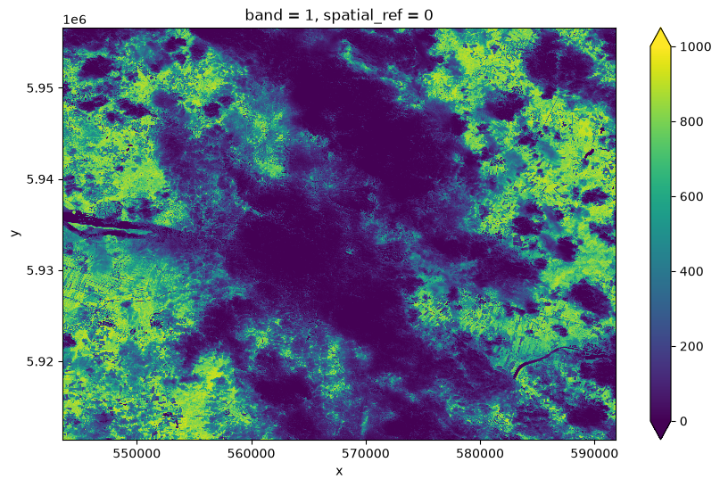

# Python API guide

Use the Python API to discover processes, submit requests, monitor jobs, and
open their results. Start with [installation and configuration](../installation.md).
The examples below use the configuration saved by `sen4cap-client configure`.

The complete [API example](https://github.com/Sen4CAP/sen4cap-client/blob/main/examples/guides/api.py)
can be run from the repository root in the development environment. Its
`inspect`, `submit`, and `results` commands let you run each stage separately.
The [original notebook](https://github.com/Sen4CAP/sen4cap-client/blob/main/notebooks/client-api.ipynb)
is also available for interactive exploration.

## Create a client

The examples use `create_client()` to load the saved service configuration and
authenticate. Explicit keyword arguments can override configuration values; see
the [configuration reference](https://eo-tools.github.io/eozilla/cuiman/configuration/).
In a Python session, create `client = create_client()` before passing it to
the functions below, and call `client.close()` when finished. The complete
script uses `contextlib.closing`
to do this even if a request fails.

```python
--8<-- "examples/guides/api.py:imports"
```

## Discover processes

List available processes, then inspect a process's inputs and outputs:

```python
--8<-- "examples/guides/api.py:inspect"
```

Run this step:

```bash
--8<-- "examples/guides/cli.sh:api-inspect"
```

This guide uses process `218` and the NDVI request from the original notebook.
Process IDs, input IDs, and available outputs depend on the service. Check its
process description and adapt the request before submitting it.

## Prepare and submit a request

The example request selects dates, NDVI, an area of interest, and an output
returned by reference. It is maintained in
[ndvi-request.json](https://github.com/Sen4CAP/sen4cap-client/blob/main/examples/guides/ndvi-request.json):

```json
--8<-- "examples/guides/ndvi-request.json"
```

Load the JSON as a `ProcessRequest` and submit it. Submission starts a job and
returns its information without waiting for processing to finish. Retain the
returned `jobID` for subsequent calls:

```python
--8<-- "examples/guides/api.py:submit"
```

```bash
--8<-- "examples/guides/cli.sh:api-submit"
```

## Monitor the job and inspect results

Replace `YOUR_JOB_ID` below with the ID printed during submission. While the
job is accepted or running, repeat this step later. If it fails or is dismissed,
inspect the job information before submitting another request.

```python
--8<-- "examples/guides/api.py:results"
```

```bash
--8<-- "examples/guides/cli.sh:api-results"
```

`client.get_jobs()` lists jobs. To cancel a running job or delete a finished
one, use `client.dismiss_job(job_id)`; see the [CLI guide](cli.md#cancel-or-delete-a-job)
for the corresponding command.

## Open and plot an asset

For the example process, the output links to a STAC item. Its assets identify
the available data products. `open_job_result()` opens the selected `SNDVI`
asset as an xarray data array. Other processes may have different asset names
or result types.

```python
--8<-- "examples/guides/api.py:plot"
```

```bash
--8<-- "examples/guides/cli.sh:api-plot"
```

Plotting requires Matplotlib, which is included in the development environment.
The image below is a saved result from the original example; a new job's
result can differ.



See the [API reference](../api.md) for the client interfaces, or the
[App guide](app.md) to explore processes visually.
