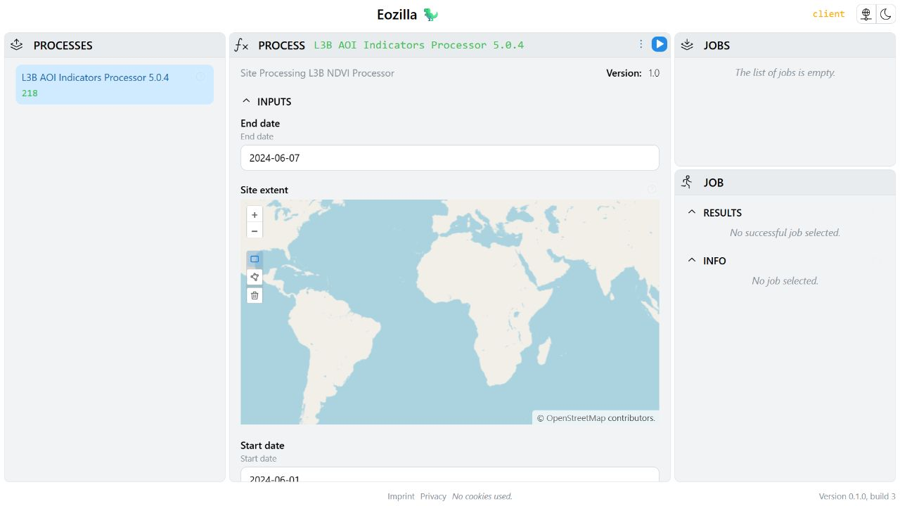

# App guide

The App provides a visual interface for choosing processes, entering inputs,
submitting jobs, and inspecting their status. It uses the configuration saved
by `sen4cap-client configure` and credentials saved by `sen4cap-client login`;
see [configuration and authentication](../configuration.md).

## Open in a browser

The simplest way to launch the App is from a terminal:

```bash
--8<-- "examples/guides/cli.sh:app"
```

Keep the terminal open while using the App. Press Ctrl+C to stop it.

## Choose a process and enter inputs

Select a process from the process list and review its description, inputs, and
outputs. This guide uses the same process `218` as the [API guide](api.md).
Your service may offer different processes or input fields.



*Historical example form from Cuiman 0.2.0.dev1. The current app's appearance,
available processes, and inputs can differ; see the
[image provenance](https://github.com/Sen4CAP/sen4cap-client/blob/main/examples/guides/README.md#static-image-provenance).*

Enter the date range and area of interest, select the desired product and
outputs, then submit the process request. Monitor the resulting job in the
App's jobs view. Results become available after processing succeeds; failed
jobs should be inspected for error details.

For raster results, use the [API guide](api.md#open-and-plot-an-asset) to open
the desired STAC asset in Python.

## Launch from Python

The [App example](https://github.com/Sen4CAP/sen4cap-client/blob/main/examples/guides/app.py)
returns both the client and the App so that you can interact with them:

```python
--8<-- "examples/guides/app.py:open"
```

Run the complete script from the repository root to open a browser and keep the
App running until Ctrl+C:

```bash
--8<-- "examples/guides/cli.sh:python-app"
```

## Use the App in a notebook

The same helper can embed the App in Jupyter. With the repository root as the
notebook's working directory, use the following example, or run it with
`%run -i examples/guides/notebook_app.py`:

```python
--8<-- "examples/guides/notebook_app.py:notebook"
```

Keep `client` and `app` available for subsequent cells. The
[original App notebook](https://github.com/Sen4CAP/sen4cap-client/blob/main/notebooks/client-gui.ipynb)
also remains available.

## Update inputs from Python

After opening process `218` in the App, call `set_dates_and_area(app)` to change
its dates and area of interest through the shared request state:

```python
--8<-- "examples/guides/app.py:request"
```

The input IDs are specific to this process. Use the IDs from your own process
description when adapting the example. Changing the request updates the form;
it does not submit a job. Review the form before executing it.

When finished with an App opened from a notebook, stop its server and close
the client:

```python
--8<-- "examples/guides/app.py:close"
```
